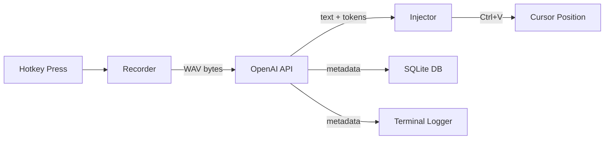

# Voice Dictation

Voice-to-text dictation tool that types transcribed speech wherever your cursor is. Uses OpenAI's transcription API as a replacement for Windows' built-in Win+H.

## Setup

```bash
# Clone and install
cd voice-dictation
pip install -e .

# Add your OpenAI API key
cp .env.example .env
# Edit .env with your key
```

## Usage

```bash
voice-dictation
```

| Hotkey | Action |
|--------|--------|
| `Ctrl+Shift+Space` | Start/stop recording |
| `Ctrl+Shift+L` | Switch language (English / Portugues) |
| `Ctrl+Shift+M` | Cycle model |
| `Ctrl+C` | Quit |

### Flow

1. Click wherever you want text to appear
2. Press `Ctrl+Shift+Space` (beep = recording)
3. Speak
4. Press `Ctrl+Shift+Space` again (beep = stopped)
5. Text is transcribed and pasted at your cursor

## Models

| Model | Cost/min | Notes |
|-------|----------|-------|
| `gpt-4o-mini-transcribe` | $0.003 | Default, fastest, cheapest |
| `gpt-4o-transcribe` | $0.006 | Best quality |
| `whisper-1` | $0.006 | Legacy |

## Terminal Output

The app logs each transcription with colored output:

- Recording start/stop indicators
- Transcription text preview
- Latency, token usage, and estimated cost per request
- Session summary on exit (total requests, audio, tokens, cost)

## Database

All transcriptions are logged to a local SQLite database (`voice_dictation.db` in the repo root, gitignored). Each record includes:

- Timestamp, transcribed text, language, model
- Audio duration, API latency
- Input/output/total tokens
- Estimated cost

## Architecture



## Project Structure

```
src/voice_dictation/
  app.py          # Main app, hotkeys, system tray, lifecycle
  config.py       # Env vars, constants, hotkey bindings
  recorder.py     # Microphone capture (sounddevice, 16kHz mono)
  transcriber.py  # OpenAI API client, token extraction
  injector.py     # Clipboard + Ctrl+V text injection (Win32)
  logger.py       # Colored terminal output
  db.py           # SQLite logging
```

## Requirements

- Python 3.11+
- Windows (uses Win32 APIs for clipboard and winsound)
- OpenAI API key
